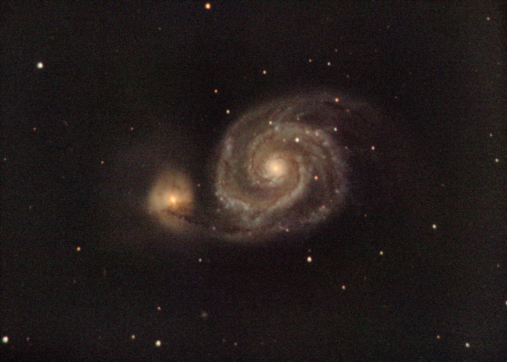
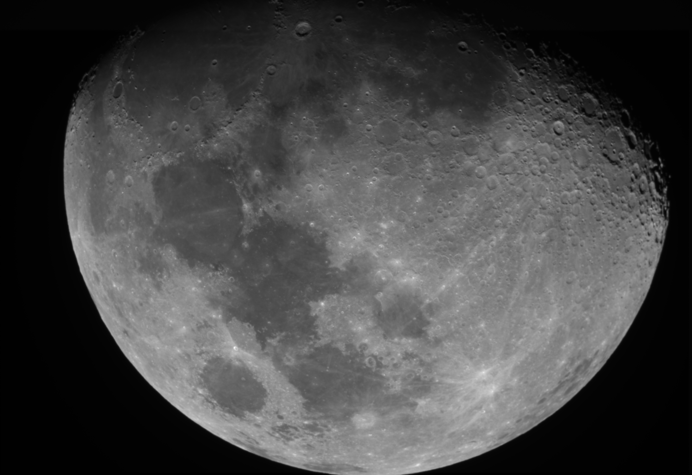

These photos were taken using an STC-7 camera, a computerised equatorial mount an an 8-inch Schmidt-Cassegrain telescope at the Ashoka University campus. Huge thanks to Philip Cherian and Pradip Chaudhari for making the setup acceesible and efficient!
  
For each image, we took multiple frames (30s exposure each) in 4 filters- luminance, red, green, blue (LRGB). We also obtained calibration frames (flats, darks, biases) and used these to reduce each frame before stacking them to produce the final result. The total exposure per filter has been listed below each image. All of the reduction and stacking tasks were performed on Siril.

## The Whirlpool Galaxy (M51)

Total exposure : 37.5 minutes per filter

Used f/6.3 focal reducer.

## The Eagle Nebula (M16)

Total exposure : ? minutes per filter

## Pleiades (M45)

Total exposure : ? minutes per filter
focal reduccer?

This is one of my favourite photos because it reveals something about how our camera works. In an attempt to capture the surrounding gas, we overexposed the stars here. With a CCD (charged coupled device) camera, an overexposed star can lead to an entire row of saturated pixels leading to a streak through the image. However, the overexposed stars here show a grid-like pattern. This is because our camera is a CMOS (complementary metal-oxide-semiconductor) device and not a CCD. CMOS cameras have amplifiers associated with every pixel which makes them faster at the cost of active detection area. To compensate for the lost active area, such sensors generally contain a microlens array which focuses all incoming light onto the available active area. What we see with the oversaturated stars here is the diffraction pattern of the microlens array. Isn't that neat?

## The Flame Nebula (NGC 2024)

Total exposure : ? minutes per filter

(There's the microlens diffraction pattern again!)

## The Orion Nebula (M42)

Total exposure : ? minutes per filter

Used f/6.3 focal reducer.

INSERT A SECOND ORION

## Moon

Total exposure : ? minutes per filter ADD MOON W/O FOCAL REDUCER

Used f/6.3 focal reducer.

