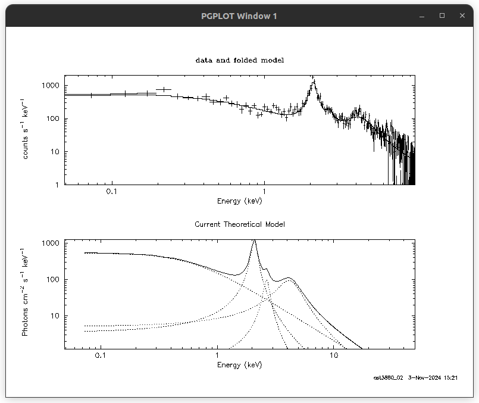
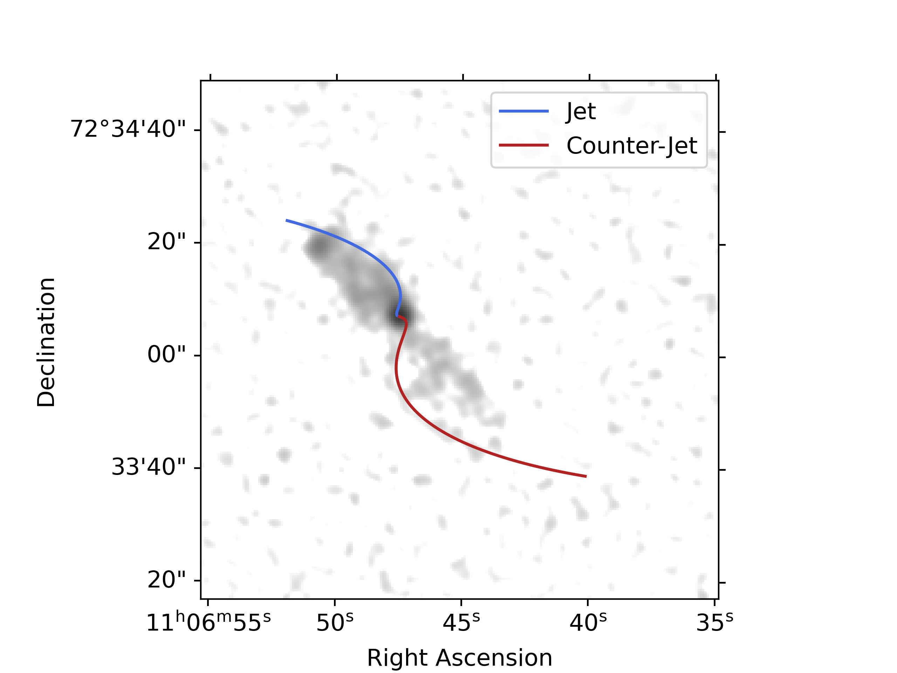

<link rel="stylesheet" href="/docs/styles.css">
I'm interested in accretion onto supermassive black holes and the effects of accretion-related instabilities on AGN feedback. I am particularly interested in exploring these systems using multi-messenger observations. I am trained in data reduction and analysis- specifically in X-ray, radio, and optical as well as basic knowledge of gwpy for graviational wave detector data. You can find details of past and ongoing projects below!

# QPOs in GX 339-4 using AstroSat Data

  A sample 4 Lorentzian fit to a QPO using <tt>xspec</tt>. 

For my undergraduate thesis, I am studying quasi-periodic oscillations in GX 339-4 which is a binary system with an evolved star accreting matter onto a stellar mass black hole (known as a low mass X-ray binary or LMXB). This involves creating a power spectrum from the X-ray lightcurve of the source and identifying broad peaks which represent oscillations with time-varying frequency or amplitude. Such oscillations are called 'quasi-periodic' (truly periodic oscillations would give a sharp peak in the power spectrum). QPOs in the power spectrum can be modelled using lorentzians (as shown in the figure above). Properties of QPOs, such as the fractional rms amplitude, change as a function of energy. Evaluating these changes allow us to 

_Advisor: Prof. Dipankar Bhattacharya_

# Multi-Scale Radio Study of NGC 3516

  Best fit precession model overlaid on a VLA image of NGC 3516.

[Project Report](/assets/research/VSRP_Report_Esha_Sajjanhar.pdf)

NGC 3516 is a low-redshift changing-look Seyfert galaxy with an S-shaped kpc-scale radio jet. This S-shaped morphology is also visible in its emission line gas, at a much smaller scale. I studied the morphology of the radio jet using archival data from the Very Large Array (VLA). I found that the S-shape of the jet could be explained using precession of the jet ejection axis.

I also studied the variability of the radio core of the galaxy. While this has been extensively studied in other wavelengths, it has not received much attention in radio. NGC 3516 went through a changing-look event in 2014 when the broad line component in its spectrum disappeared, and it showed some re-brightening in early 2020 that may indicate the beginning of a new CL event. I looked at Very Long Baseline Array (VLBA) images of this source and compared the radio brightness of the source in these different epochs. I found that the radio brightness changed with the brightness of the optical emission lines. This is very interesting because it indicates that the variability in this source is intrinsic, i.e., it is due to instabilities in accretion rate. While the radio core was unresolved around 2001, we found that there was some diffuse emission in 2020 following an X-ray flare in the source. This could indicate the ejection of a new jet component. However, due to limited observations of the source, this result couldn't be verified. This led me to propose for time on the VLBA to allow us to improve our understanding of the relationship between AGN variability and jet ejection. I wrote this proposal as the principal investigator working with Dr. Preeti Kharb and Salmoli Ghosh. We were awarded 18 hours on the VLBA in the 2025A semester for our observations.

_Advisor: Dr. Preeti Kharb (NCRA-TIFR)_

# Detecting the HI Line with a Horn Antenna

  The horn antenna at Ashoka University.

[Poster](/assets/research/)

This antenna was built by Pradip Chaudhari in Physics lab at Ashoka. I worked on testing this horn and using it to identify the 21 cm emission line due to galactic Hydrogen. This involved 

_Mentors: Prof. Dipankar Bhattacharya, Philip Cherian_
